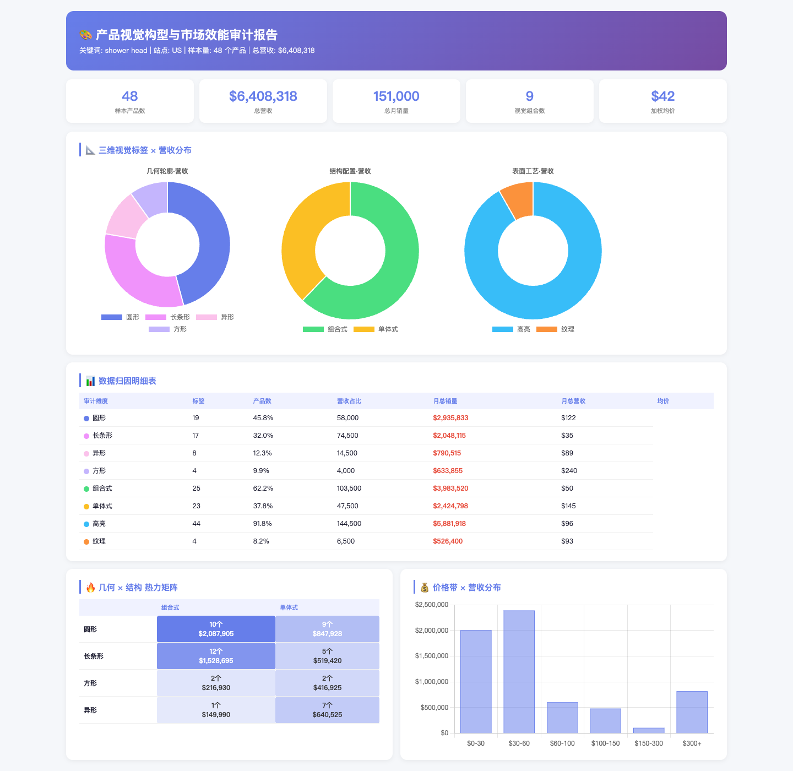
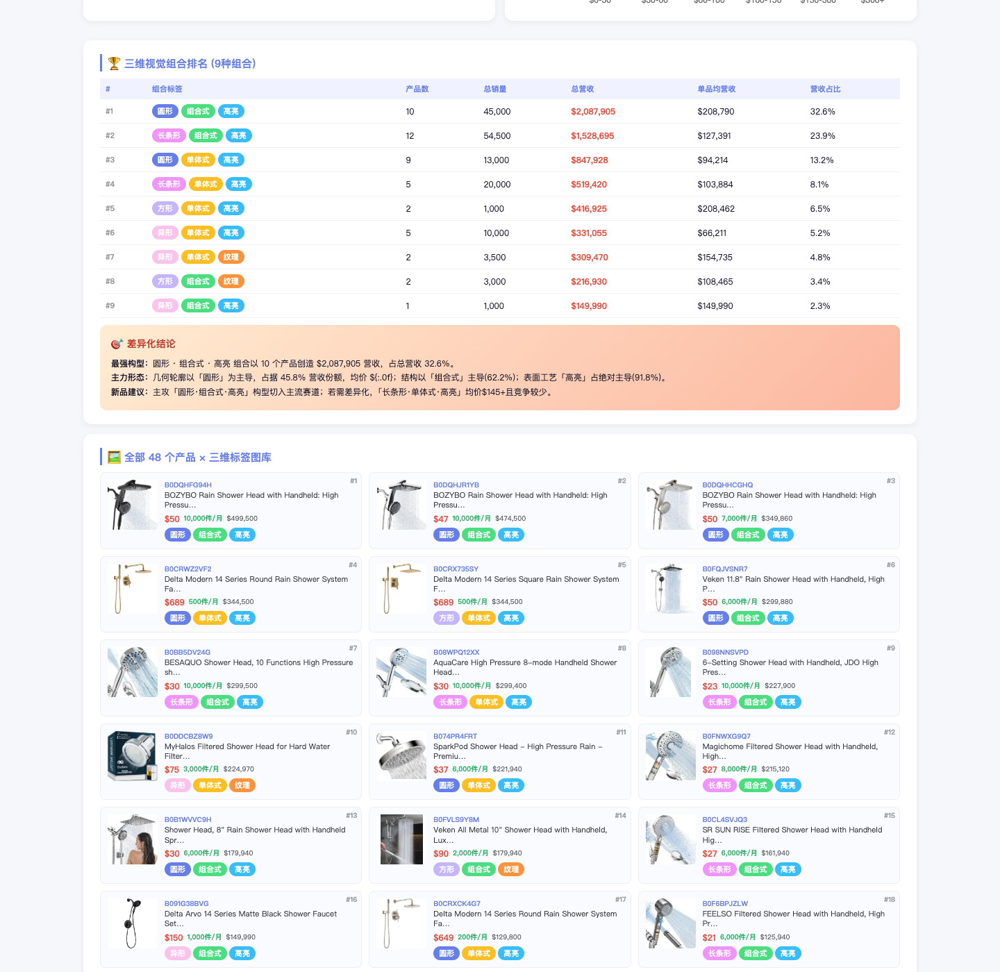
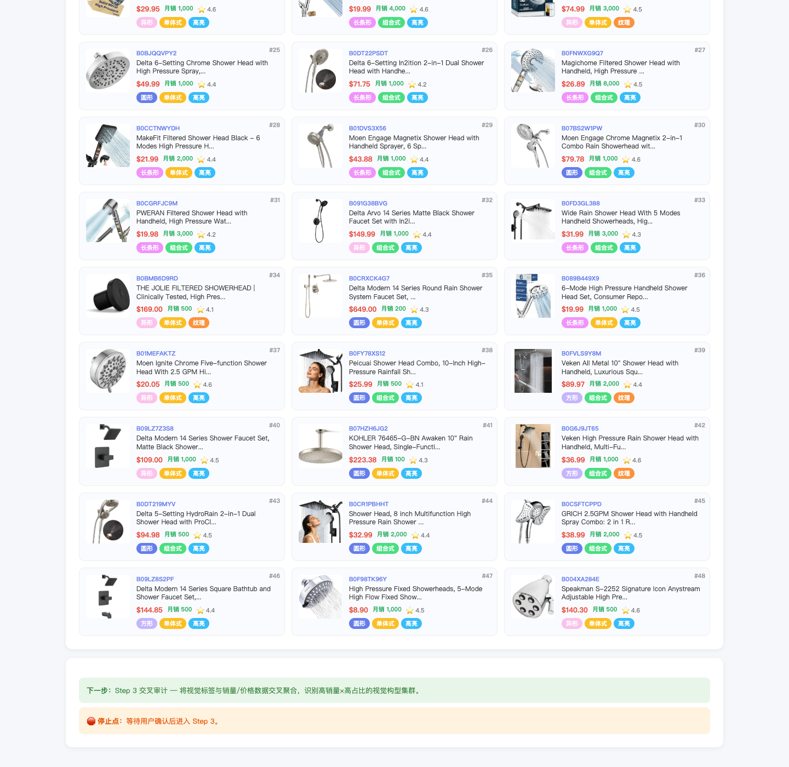

# Amazon Visual Architecture Audit

[中文](#中文简介) | [English](#english)

Turn Amazon search-result visuals into a traceable commercial map.

This skill answers one narrow question really well:

**Which product form makes more money in a category search result set?**

Instead of generating a generic competitor report, it samples Amazon search results, downloads main images, tags each product on a three-layer visual system, links those tags to sales and price signals, and delivers a dashboard that shows what kind of "look" is winning.



## Why this repo exists

Most Amazon research workflows focus on:

- price
- reviews
- keywords
- listing copy
- rating and volume

This skill adds a missing layer:

**visual structure as a commercial signal**

That makes it useful when you want to move from:

- "this shape looks common"

to:

- "this shape-structure-surface combination is correlated with more revenue in the sampled result set"

## What the skill does

### 1. Collect a visible sample

The workflow starts from a keyword, marketplace, and sample depth.

It reads Amazon search results and captures:

- ASIN
- title
- main image
- price
- rating
- recent bought signal

### 2. Turn each product into a visual sample

Each listing is tagged on three dimensions:

- `geometry`: round / square / elongated / irregular
- `structure`: single / combo / modular
- `surface`: glossy / matte / textured / transparent

### 3. Cross visual tags with business signals

It aggregates:

- product count
- estimated monthly sales
- revenue
- average price
- cross-combination rankings

### 4. Deliver a strategic dashboard

The final output includes:

- KPI summary
- three-dimension revenue distributions
- attribution tables
- geometry x structure heatmap
- price-band distribution
- top visual combinations
- full tagged gallery



## The decomposition idea

This repository is not just a specific skill.

It is also a reusable pattern for building stepwise Codex skills that are:

- narrow in boundary
- traceable in reasoning
- deterministic where possible
- checkpointed for human review

The core principle is simple:

**Do not let the model improvise the whole job.**

Split the workflow into layers:

1. Scope and confirm the run
2. Collect the raw sample
3. Transform fuzzy observations into explicit tags
4. Cross tags with business metrics
5. Deliver a fixed-format report

That is what makes the skill feel less like a prompt and more like a small operator tool.

## Skill structure

```text
amazon-visual-architecture-audit/
├── SKILL.md
├── README.md
├── requirements.txt
├── references/
│   └── workflow-node-io.md
├── scripts/
│   ├── step1_fetch_products.py
│   ├── step2_visual_tag.py
│   ├── step3_cross_audit.py
│   └── step4_generate_report.py
├── docs/
│   └── media/
└── assets/
    └── results/
```

### What each part is for

- `SKILL.md`: the contract, boundaries, checkpoints, and pass conditions
- `references/`: node-by-node handoff logic and execution table
- `scripts/`: deterministic transforms for tagging, aggregation, and report generation
- `assets/results/`: stage outputs and sample reports
- `docs/media/`: README screenshots for fast understanding

## Why this structure is reusable

This structure works beyond this specific Amazon use case.

You can adapt the same framework for:

- competitor image architecture audits
- category visual language mapping
- packaging-form audits
- review + visual correlation studies
- marketplace-specific product-form comparisons

### Reusable framework

If you want to build similar skills, this is the pattern worth copying:

1. Define one narrow question.
2. Confirm scope before data collection.
3. Keep raw sample separate from interpretation.
4. Convert vague signals into explicit tags.
5. Cross those tags with business metrics.
6. Deliver a stable report format with visible checkpoints.

### Why it works

- narrow scope reduces drift
- checkpoints prevent silent long-running execution
- deterministic scripts reduce prompt randomness
- stage outputs make the workflow reviewable
- final dashboards summarize without hiding the evidence

## Workflow snapshots

The skill keeps stage outputs visible, so users can inspect the work before moving on.

### Tagging stage

This is where the workflow stops being "just search results" and becomes a reusable visual sample set.



### Final strategy view

This is where visual form, structure, price band, and commercial signal are brought together in one deliverable.


## Quick start

### Install dependencies

```bash
python3 -m venv .venv
source .venv/bin/activate
pip install -r requirements.txt
```

### Read the workflow contract

Start with:

- `SKILL.md`
- `references/workflow-node-io.md`

### Run the transformation steps

Step 1 is browser-assisted and follows the extraction pattern in `scripts/step1_fetch_products.py`.

Then run:

```bash
python3 scripts/step2_visual_tag.py \
  --input assets/results/step1/products_raw.json \
  --images-dir assets/results/step1/images \
  --output assets/results/step2/visual_tags.json

python3 scripts/step3_cross_audit.py \
  --products assets/results/step1/products_raw.json \
  --tags assets/results/step2/visual_tags.json \
  --output-dir assets/results/step3

python3 scripts/step4_generate_report.py \
  --products assets/results/step1/products_raw.json \
  --tags assets/results/step2/visual_tags.json \
  --audit assets/results/step3/audit_results.json \
  --images-dir assets/results/step1/images \
  --keyword "shower head" \
  --marketplace "US" \
  --output assets/results/report/visual_architecture_audit_report.html
```

## Current limits

- sales are estimated from front-end signals, not backend truth
- the tag system is intentionally coarse in v1
- visual correlation should guide research, not replace full product strategy validation

## Best fit

Use this skill when you want:

- a bounded visual audit
- visible stage checkpoints
- reusable intermediate outputs
- a report that operators, founders, and designers can discuss immediately

---

## 中文简介

这是一个把亚马逊搜索结果“视觉化拆解”的 Skill。

它不做泛泛的竞品分析，而是专门回答一个很具体的问题：

**一个品类里，到底哪种产品长相更赚钱？**

它会做四件事：

1. 采样搜索结果
2. 下载主图并做三维视觉打标
3. 把视觉标签和销量、价格、营收估算做交叉分析
4. 输出一份可直接讨论的可视化看板

### 这套 Skill 的价值

大部分亚马逊分析只看价格、评论、关键词和文案。

这套 Skill 额外补了一层：

**把视觉构型当成商业信号来看。**

也就是说，它不是停在“这个图看起来很多”，而是进一步回答：

- 哪种轮廓更容易占营收
- 哪种结构更像主流配置
- 哪种材质感更符合品类视觉语言
- 哪些视觉组合同时具备销量和价格优势

### 这套拆解思路为什么可复用

这套仓库真正值得复用的，不只是某个亚马逊类目的结果，而是它背后的 Skill 方法：

1. 先把问题定义得足够窄
2. 先确认范围，再开始采集
3. 把原始样本和解释过程拆开
4. 把模糊观察变成明确标签
5. 再把标签和商业指标做交叉
6. 最后用固定格式交付

这套框架可以继续迁移到：

- 竞品主图架构审计
- 品类视觉语言地图
- 包装形态研究
- 评论与视觉表达联动分析
- 不同站点的产品形态比较

### 仓库结构

- `SKILL.md`：规则、边界、停点、通过条件
- `references/`：节点输入输出和阶段路由
- `scripts/`：打标、聚合、报告生成等确定性动作
- `assets/results/`：阶段报告和样例结果
- `docs/media/`：README 展示图

### 一句话总结

这不是一个“更长的提示词”。

它更像一个有边界、有阶段产物、有可视化交付的微型运营工具。

---

## English

This repository contains a stepwise Codex skill for turning Amazon search-result visuals into a commercial decision surface.

It is designed around one narrow question:

**Which visual product form is performing best in the sampled category result set?**

The main reusable value is not only the specific audit, but the framework behind it:

- narrow question
- explicit checkpoints
- deterministic transformations
- visible stage outputs
- fixed final delivery

If you build operational skills, this pattern is usually more durable than a large one-shot prompt.
